# Тестування працездатності системи

## Докомунтування та тестування запитів було виконно за допомогою FastAPI docs 

## Загальна структура запитів

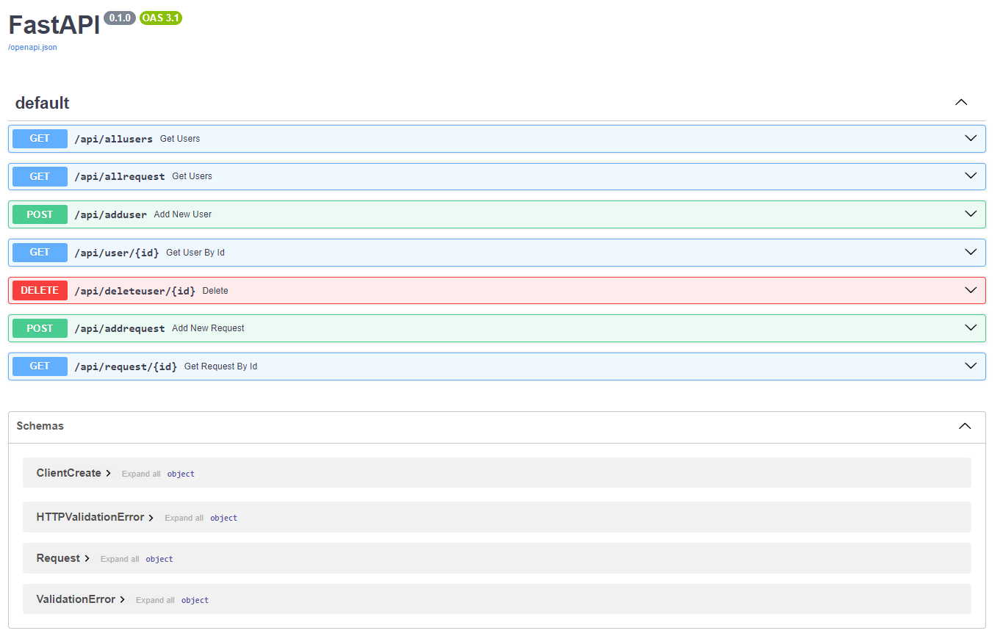

### Отримання данних про користувача

#### Отримати данні про всіх користувачів

#### Данні в базі данних

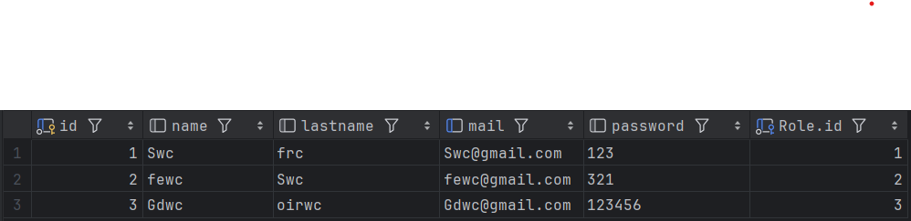

#### Створити нового користувача

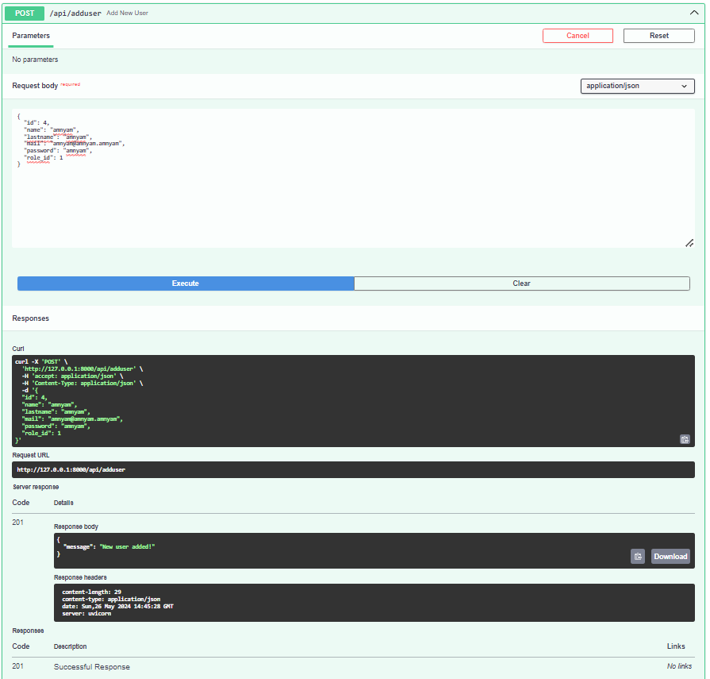

#### Данні в базі данних

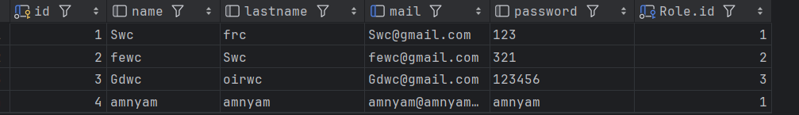

#### Отримати данні про конкретного користувача

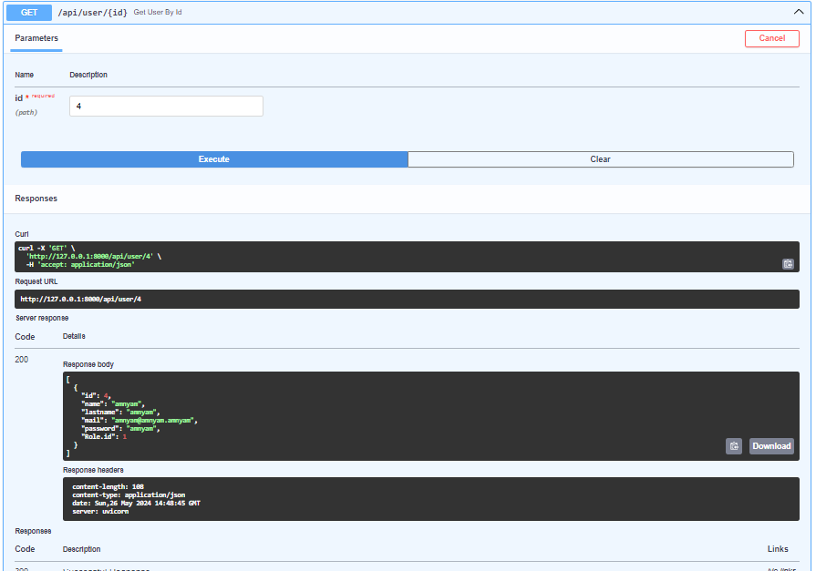

#### Видалити користувача

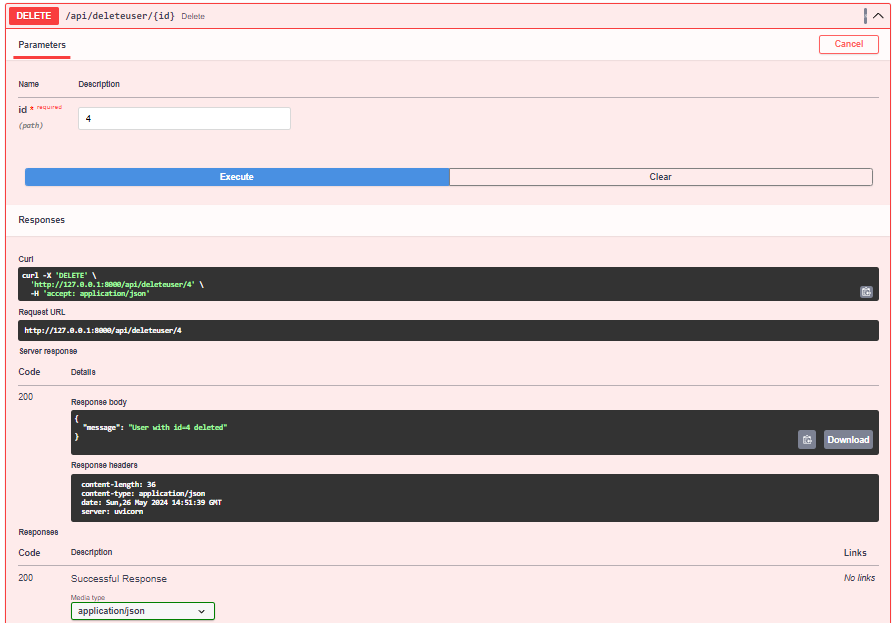

#### Данні в базі данних

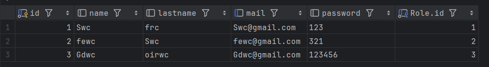

## Отримання данних про запити

#### Отримати данні про всі запити

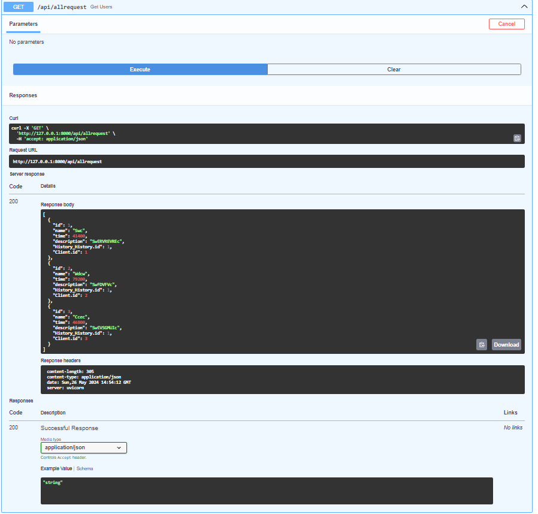

#### Данні в базі данних

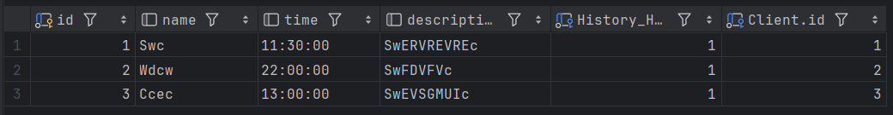

#### Додати запит

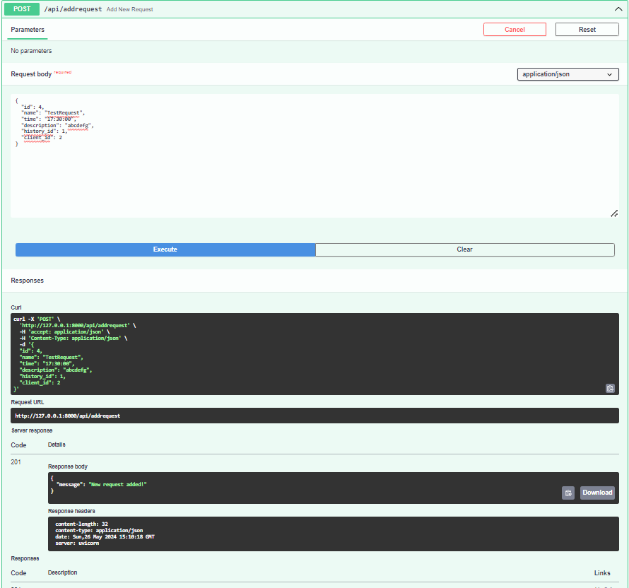

#### Данні в базі данних

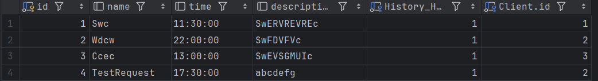